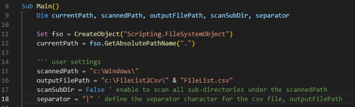
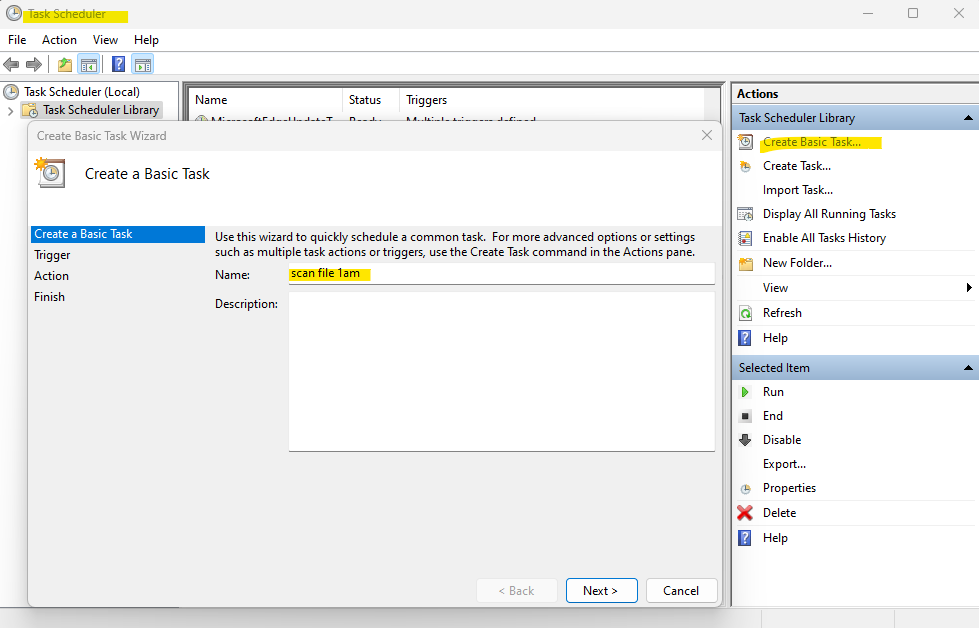
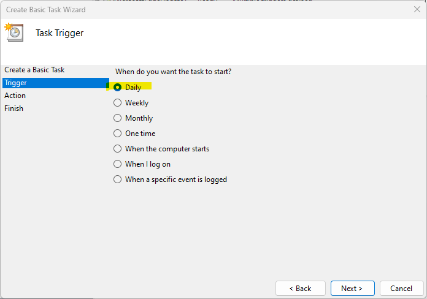
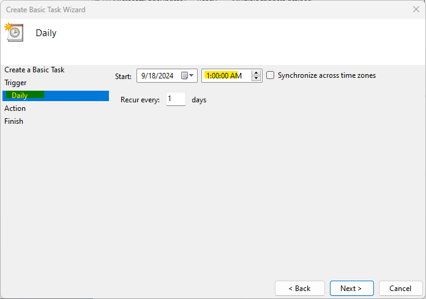
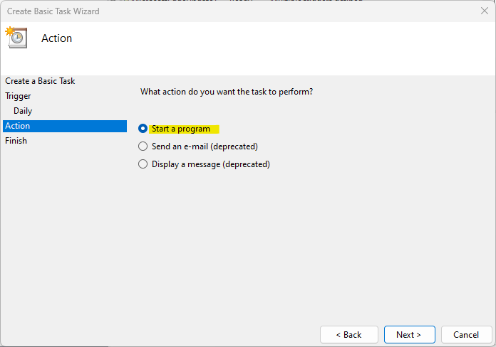
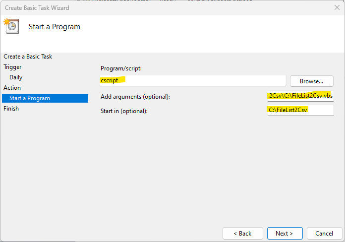
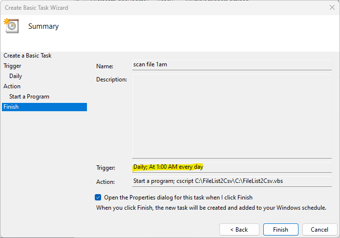

# FileList2Csv
---
## set the paths and parameters
)
## set the Task Schedule
1. open the Windows Task Schedule
2. select Create Basic Task and enter the task name.

3. Task Trigger, select Daily.

4. set the time to run.

5. Action, select Start a Program.

6. Enter the Task parameters.
- Program = cscript
- Arguments = full path to the FileList2Csv.vbs file on your computer
- Start in = the same path in the arguments (only path , not include te filename)
)
)
7. Finish.
)