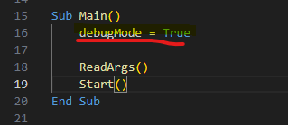
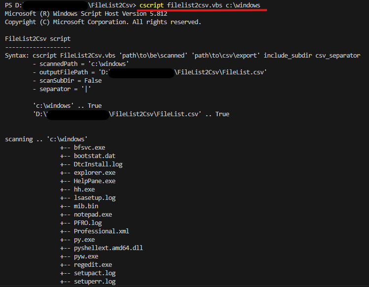
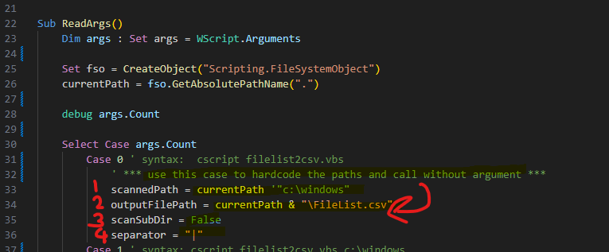
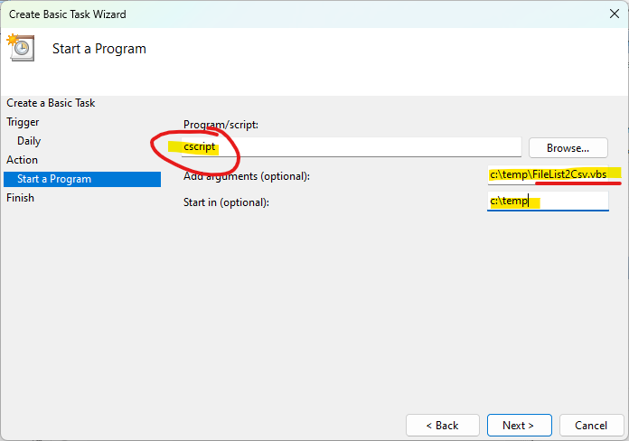

# FileList2Csv
### Description.
> this vbscript is for scanning all files & folders under the specified path. and write them down into a .csv file which can be opened by Excel.
### How to use the script in command line mode.
> `cscript FileList2Csv.vbs "path\to\be\scanned" "path\of\the\csv\outout\file" scan_subdir_or_not "csv_separator"`
- "path\to\be\scanned" ... your path to be scanned
- "path\of\the\csv\outout\file" ... the path for csv file (output)
- scan_subdir_or_not ... (optional) if you want to scan all sub-folders, set it to be True
- "csv_separator" ... (optional) if you want to use your csv separator, set it to be ","
- debugMode ... (optional) if you want to run in quiet mode, set it to be False.

> running result.

> [csv output file](FileList.csv)
### How to use the script by Windows Task Scheduler.
1. Open the code and hardcode your paths and some parameters.

2. open the Windows Task Schedule, select Create Basic Task and then enter the task name.

3. Task Trigger, select Daily.

4. set the time to run.

5. Action, select Start a Program.

6. Enter the Task parameters.
- Program = cscript
- Arguments = full path to the FileList2Csv.vbs file on your computer
)
)
7. Finish.
)
