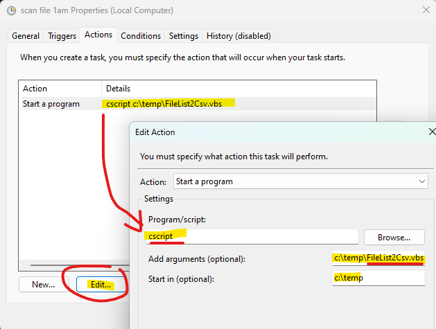

# FileList2Csv
### Description.
> this vbscript is for scanning all files & folders under the specified path. and write them down into a .csv file which can be opened by Excel.
### How to use the script in command line mode.
> `cscript FileLit2Csv.vbs "path\to\be\scanned" "path\of\the\csv\outout\file" scan_subdir_or_not "csv_separator"`
### How to use the script by Windows Task Scheduler.
1. Open the code and hardcode your paths and some parameters.
)
2. open the Windows Task Schedule, select Create Basic Task and then enter the task name.

3. Task Trigger, select Daily.

4. set the time to run.

5. Action, select Start a Program.

6. Enter the Task parameters.
- Program = cscript
- Arguments = full path to the FileList2Csv.vbs file on your computer
)
)
7. Finish.
)
